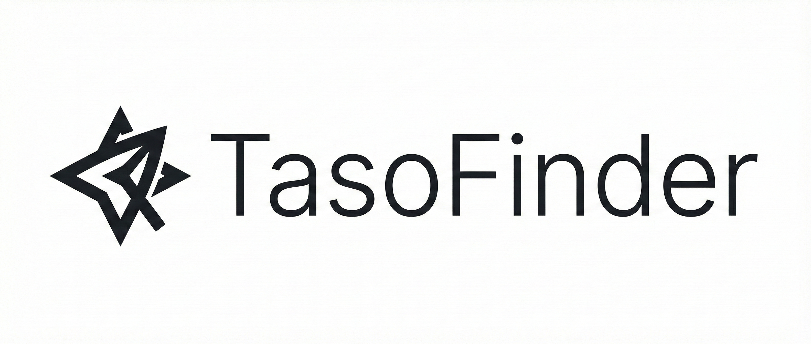

# 🎯 TasoFinder - Akıllı Cümle Paraphrase Platformu

<div align="center">



**Akıllı cümle yeniden ifade etme ve kelime arama platformu**

[](https://www.python.org/)
[](https://flask.palletsprojects.com/)
[](LICENSE)
[](https://github.com/tahsinmert/tasofinder-paraphrase-web-app)

**Coded By** [Tahsin Mert Mutlu](https://github.com/tahsinmert)

[Özellikler](#-özellikler) • [Kurulum](#-kurulum) • [Kullanım](#-kullanım) • [API](#-api) • [Teknolojiler](#-teknolojiler)

</div>

---

## 📖 Hakkında

**TasoFinder**, akademik ve profesyonel yazım için geliştirilmiş, gelişmiş yapay zeka destekli bir cümle paraphrase (yeniden ifade etme) platformudur. NLTK ve WordNet teknolojilerini kullanarak, cümlelerinizi anlam kaybı olmadan farklı varyasyonlara dönüştürür.

### 🌟 Temel Özellikler

- ✅ **Gelişmiş Paraphrase Algoritması** - Anlamı koruyarak cümleleri yeniden ifade eder
- ✅ **Turnitin AI Dedektörüne Takılmaz Mod** - Akademik intihal kontrollerinden geçer
- ✅ **Toplu Paraphrase** - Birden fazla paragrafı aynı anda işler
- ✅ **Kelime Arama** - Eş anlamlı, zıt anlamlı ve ilgili kelimeler bulur
- ✅ **Stil Tonları** - Akademik, resmi, günlük, dengeli ve basit stiller
- ✅ **Modern ve Minimalist Arayüz** - Kullanıcı dostu, responsive tasarım

---

## ✨ Özellikler

### 🔄 Paraphrase Özellikleri

#### **Tekil Paraphrase**
- 1-10 arası varyasyon üretme
- Anlam benzerliği skorlaması
- En iyi varyasyon önerisi
- Detaylı istatistikler (benzerlik, kelime değişimi, uzunluk farkı)

#### **Toplu Paraphrase**
- Birden fazla paragrafı aynı anda işleme
- İlerleme çubuğu ile takip
- Her paragraf için ayrı sonuçlar
- Toplu işlem istatistikleri

#### **Stil Tonları**
- 🎯 **Dengeli** - Ortalama bir yaklaşım
- 👔 **Resmi** - Profesyonel ve resmi dil
- 😊 **Günlük** - Günlük konuşma dili
- 🎓 **Akademik** - Akademik yazım stili (varsayılan)
- 📖 **Basit** - Basitleştirilmiş dil

#### **Cümle Uzunluğu Tercihleri**
- ↔️ **Aynı** - Orijinal uzunluğu korur
- ⬇️ **Daha Kısa** - Kısa cümleler oluşturur
- ⬆️ **Daha Uzun** - Uzun cümleler oluşturur

### 🛡️ Turnitin AI Dedektörüne Takılmaz Mod

En üst düzey gelişmiş algoritmalar kullanarak:

- Kelimelerin **%85-95'ini** en az yaygın sinonimlerle değiştirir
- **N-gram benzerliğini azaltır** (2-gram ve 3-gram analizi)
- Cümle yapısını **tamamen yeniden düzenler** (phrases, clauses)
- **Aktif/pasif dönüşüm** ve kelime sırası değişiklikleri
- **En az kullanılan sinonimler** (son %30) ile benzersizlik
- **Prepositional phrase** yeniden düzenleme
- Orijinal cümleden **minimum %70 kelime farklılığı** garantisi
- **%60+ bigram ve %50+ trigram** farklılık kontrolü
- **Kombine skor %65+** farklılık garantisi

### 📚 Kelime Arama

- **Eş Anlamlılar** (Synonyms)
- **Zıt Anlamlılar** (Antonyms)
- **İlgili Kelimeler** (Related Words)
- **Örnek Cümleler** (Example Sentences)

### 🎨 Kullanıcı Arayüzü

- **Modern ve Minimalist Tasarım** - Temiz, profesyonel görünüm
- **Responsive** - Mobil ve masaüstü uyumlu
- **Karanlık Mod Desteği** - Göz dostu tema
- **Klavye Kısayolları** - Ctrl+Enter / Cmd+Enter ile hızlı paraphrase
- **Otomatik Scroll** - Sonuçlara otomatik kaydırma
- **Kopyala-Yapıştır** - Tek tıkla sonuçları kopyalama
- **Animasyonlar** - Smooth geçişler ve loading göstergeleri

---

## 🚀 Kurulum

### Gereksinimler

- Python 3.8 veya üzeri
- pip (Python paket yöneticisi)

### Adım Adım Kurulum

1. **Repository'yi klonlayın:**
   ```bash
   git clone https://github.com/tahsinmert/tasofinder-paraphrase-web-app.git
   cd tasofinder-paraphrase-web-app
   ```

2. **Sanal ortam oluşturun (önerilir):**
   ```bash
   python3 -m venv venv
   source venv/bin/activate  # Linux/Mac
   # veya
   venv\Scripts\activate  # Windows
   ```

3. **Bağımlılıkları yükleyin:**
   ```bash
   cd SynonymFinder
   pip install -r requirements.txt
   ```

4. **Gerekli NLTK verilerini indirin:**
   Uygulama ilk çalıştırıldığında otomatik olarak indirilecektir.

5. **Uygulamayı başlatın:**
   ```bash
   python app.py
   ```

6. **Tarayıcınızda açın:**
   ```
   http://localhost:5000
   ```

### Production Kurulumu

Production ortamı için `gunicorn` veya `uwsgi` kullanabilirsiniz:

```bash
pip install gunicorn
gunicorn -w 4 -b 0.0.0.0:5000 app:app
```

---

## 💻 Kullanım

### Web Arayüzü

1. **Paraphrase Sekmesi:**
   - Cümlenizi textarea'ya yazın
   - Varyasyon sayısını seçin (1-10)
   - Stil tonunu seçin (Akademik, Resmi, vb.)
   - Cümle uzunluğu tercihini seçin
   - Turnitin modunu aktif edin (isteğe bağlı)
   - "Paraphrase Oluştur" butonuna tıklayın veya **Ctrl+Enter / Cmd+Enter** kullanın

2. **Toplu Paraphrase Sekmesi:**
   - Birden fazla paragrafı textarea'ya yazın (her satır bir paragraf)
   - Ayarları yapın
   - "Toplu Paraphrase Oluştur" butonuna tıklayın

3. **Kelime Arama Sekmesi:**
   - Arama yapmak istediğiniz kelimeyi girin
   - "Ara" butonuna tıklayın
   - Eş anlamlı, zıt anlamlı, ilgili kelimeler ve örnekleri görüntüleyin

### API Kullanımı

#### Paraphrase Endpoint

```bash
POST /api/paraphrase
Content-Type: application/json

{
  "sentence": "The quick brown fox jumps over the lazy dog.",
  "num_variations": 5,
  "style": "academic",
  "length_preference": "same",
  "anti_detection": false
}
```

**Response:**
```json
{
  "original": "The quick brown fox jumps over the lazy dog.",
  "variations": [
    {
      "text": "The swift brown fox leaps over the lazy dog.",
      "score": 0.85,
      "similarity": 0.92,
      "word_changes": 2,
      "length_diff": 0
    }
  ],
  "best_variation": "...",
  "best_score": 0.92,
  "best_reason": "...",
  "word_replacements": {...}
}
```

#### Toplu Paraphrase Endpoint

```bash
POST /api/bulk-paraphrase
Content-Type: application/json

{
  "paragraphs": [
    "First paragraph text...",
    "Second paragraph text..."
  ],
  "num_variations": 3,
  "style": "academic",
  "length_preference": "same"
}
```

#### Kelime Arama Endpoint

```bash
GET /api/lookup?word=example
```

**Response:**
```json
{
  "word": "example",
  "synonyms": ["instance", "case", "illustration"],
  "antonyms": [],
  "related": ["sample", "model", "pattern"],
  "examples": ["This is an example.", "For example,..."]
}
```

---

## 🔧 Teknolojiler

### Backend
- **Flask** - Web framework
- **NLTK** - Doğal dil işleme
- **WordNet** - Sözlük ve semantik veritabanı
- **Python 3.8+** - Programlama dili

### Frontend
- **HTML5** - İşaretleme dili
- **CSS3** - Stil ve tasarım
- **Tailwind CSS** - Utility-first CSS framework
- **JavaScript (Vanilla)** - İstemci tarafı mantık
- **Inter Font** - Modern tipografi

### Özellikler
- **POS Tagging** - Kelime türü belirleme
- **Semantic Similarity** - Anlamsal benzerlik hesaplama
- **N-gram Analysis** - N-gram analizi
- **Synonym Replacement** - Eş anlamlı kelime değiştirme
- **Sentence Structure Transformation** - Cümle yapısı dönüşümü

---

## 📊 Performans

- **Hızlı İşleme** - Ortalama 1-3 saniye arası yanıt süresi
- **Ölçeklenebilir** - Gunicorn ile multi-worker desteği
- **Hafif** - Minimum bağımlılık, optimize edilmiş kod
- **Responsive** - Mobil ve masaüstü performansı

---

## 🎯 Kullanım Senaryoları

### Akademik Yazım
- Makale ve tez yazımı
- Kaynakları yeniden ifade etme
- İntihal önleme
- Farklı varyasyonlar üretme

### Profesyonel İçerik
- Blog yazıları
- E-posta içerikleri
- Raporlar ve dokümantasyon
- İçerik çeşitlendirme

### Eğitim
- Öğrenciler için yazım yardımı
- Kelime dağarcığı geliştirme
- Farklı yazım stillerini öğrenme

---

## 🔒 Güvenlik ve Gizlilik

- **Yerel İşleme** - Veriler sunucuda işlenir, üçüncü parti servislere gönderilmez
- **Açık Kaynak** - Kod tamamen şeffaf ve incelebilir
- **Gizlilik** - Kullanıcı verileri kaydedilmez
- **Güvenli** - Standart Flask güvenlik önlemleri

---

## 🤝 Katkıda Bulunma

Katkılarınızı bekliyoruz! Lütfen şu adımları izleyin:

1. Fork edin
2. Feature branch oluşturun (`git checkout -b feature/AmazingFeature`)
3. Değişikliklerinizi commit edin (`git commit -m 'Add some AmazingFeature'`)
4. Branch'inizi push edin (`git push origin feature/AmazingFeature`)
5. Pull Request açın

---

## 📝 Lisans

Bu proje MIT lisansı altında lisanslanmıştır. Detaylar için `LICENSE` dosyasına bakın.

---

## 👤 Yazar

**Tahsin Mert Mutlu**

- GitHub: [@tahsinmert](https://github.com/tahsinmert)
- Repository: [tasofinder-paraphrase-web-app](https://github.com/tahsinmert/tasofinder-paraphrase-web-app)

---

## 🙏 Teşekkürler

- **NLTK** ekibine WordNet entegrasyonu için
- **Flask** topluluğuna harika dokümantasyon için
- **Tailwind CSS** ekibine utility-first framework için
- Tüm açık kaynak katkıda bulunanlara

---

## 📞 İletişim ve Destek

Sorularınız veya önerileriniz için:
- GitHub Issues açabilirsiniz
- Pull Request gönderebilirsiniz

---

<div align="center">

**⭐ Projeyi beğendiyseniz yıldız vermeyi unutmayın! ⭐**

Made with ❤️ by [Tahsin Mert Mutlu](https://github.com/tahsinmert)

</div>

